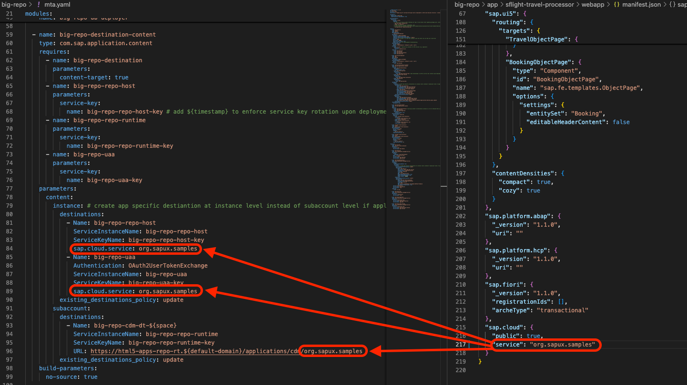
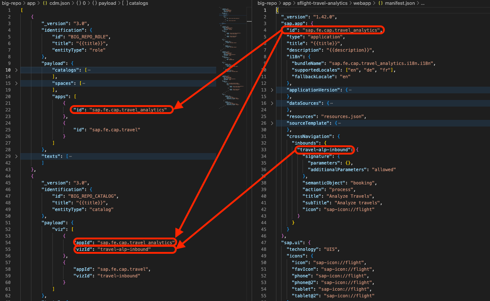

<a name="readme-top"></a>

<!-- PROJECT LOGO -->
<br />
<div align="center">
  <h3 align="center">big-repo</h3>
  <p align="center">
    Sample app for multiple UI5 apps build & deployment as Work-zone Business Solution / Content Provider
  </p>
</div>

<!-- TABLE OF CONTENTS -->
<details>
  <summary>Table of Contents</summary>
  <ol>
    <li>
      <a href="#project-layout">Project layout</a>
    </li>    
    <li>
      <a href="#getting-started">Getting started</a>
      <ul>
        <li><a href="#prerequisites">Prerequisites</a></li>
        <li><a href="#build">Build</a></li>
        <li><a href="#deploy">Deploy</a></li>
      </ul>
    </li>    
    <li>
      <a href="#consolidate-apps">Consolidate apps into big repo</a>
      <ul>
        <li><a href="#consolidate-db">Consolidate DB</a></li>
        <li><a href="#consolidate-srv">Consolidate SRV</a></li>
        <li><a href="#consolidate-ui">Consolidate UI</a></li>
      </ul>
    </li>    
    <li>
      <a href="#extensions">List of extensions</a>
    </li>
  </ol>
</details>

<!-- PROJECT LAYOUT -->
## Project layout

File or Folder | Purpose
---------|----------
`app/` | content for UI frontends and cdm.json
`db/` | your domain models and data
`srv/` | your service models and code
`package.json` | project metadata and configuration
`readme.md` | this getting started guide

<!-- GETTING STARTED -->
## Getting Started

This is an example of how you may give instructions on setting up and deploying your project.

### Prerequisites

1. Ensure you have the latest LTS version of Node.js installed (see [Getting Started](https://cap.cloud.sap/docs/get-started/))
2. Install [**@sap/cds-dk**](https://cap.cloud.sap/docs/get-started/) globally:

   ```sh
   npm i -g @sap/cds-dk
   ```

3. Ensure you have Workzone subscription in the deployment target sub-account
4. Ensure you have HANA Cloud service instance running (standard or free-tier) in the deployment target space
5. _Optional:_ [Use Visual Studio Code](https://cap.cloud.sap/docs/get-started/tools#vscode)

### Build

1. After checking out repo or updating package.json, execute below command to install npm modules for the first time

   ```sh
   npm ci
   ```
2. Afterwards execute beload command to build the project

   ```sh
   npm run build
   ```

### Deploy

1. CF login into the target space, then deploy the app

   ```sh
   cf login
   npm run deploy
   ```

2. Aftewards navigate to target sub-account BTP cockpit->destination, update big-repo-cdm-rt (cdm runtime destination) and replace <b>{subdomain}</b> with the actual subdomain of the sub-account
3. Open target sub-account's Workzone Site Manager -> Channel Manager, click on New -> Content Provider, enter below info:
   - Title: big_repo
   - ID: big_repo
   - Design-Time Destination: big-repo-cdm-dt
   - Runtime Destination: big-repo-cdm-rt
4. Make sure newly created content channel's status is 'Updated'
   - if there's error, check cdm.json appId/visId and mta.yaml->sap.cloud.service, make sure they match UI5 apps' manifest.json
5. Navigate to Workzone Site Directory -> Settings -> Add Big Repo Role to the site
6. Navigate to BTP cockpit -> Role Collections, assign ~big_repo_BIG_REPO_ROLE to test users
7. Open Workzone to test the apps

## Consolidate apps

- This section describes how to consolidate or convert CAP apps including db, srv and app(ui5) modules into a monolith big-repo as Work-zone business solution.

### Consolidate DB (if applicable)

1. Copy your origin app's db folder content into this app's db folder
2. Rename data model file names to application specific schema name for instance: 
   - schema.cds -> sflight-schema.cds

### Consolidate SRV

1. Copy your origin app's srv folder content into this app's srv folder
2. Rename CAP service file names to application specific service names instance: 
   - travel-service.cds -> sflight-travel-service.cds
   - travel-service.js -> sflight-travel-service.js
3. Make sure to update the reference of data models in your servce.js
4. Merge dependencies into package.json 
5. Add/merge cds->requires connections into package.json
6. Add/merge scopes, roles into xs-security.json. <br >
<b>Note:</b> you may want to change scope and role names to more application specific name for instance: 
   - $XSAPPNAME.Display -> $XSAPPNAME.SFlightDisplay

### Consolidate UI

1. Copy the UI5 apps from app/* folder to this repo
2. Open app/{your_app}/webapp/manifest.json, change <b>sap.cloud.service</b> to the same value as mta.yaml -> big-repo-dest-content -> instance -> destinations -> cases-repo-host -> sap.cloud.service (current value: <b>org.sapux.samples</b>)<br />

3. Take a note of the manifest.json -> sap.app.id <b>{appId}</b> and sap.app.crossNavigation.inbounds <b>{vizId}</b>, add them into corresponding cdm.json->catalog/space/page/section. <br />

   - (Optional) In case you want to test the app locally via ./app/launchpad.html - add the {appId} and {vizId} into ./app/cdm-local.json
4.  Open app/{your_app}/ui5-deploy.yaml, take a note of <b>{archiveName}</b>
5. Update mta.yaml, add html5 module
```yaml
  - name: {archiveName}
    type: html5
    path: app/{your_app}
    build-parameters:
      build-result: dist
      builder: custom
      commands:
        - npm run build:cf
      supported-platforms: []
```
6. In mta.yaml, add html5 module to app-content
```yaml
  - name: big-repo-app-content
    type: com.sap.application.content
    path: .
    requires:
      - name: big-repo-dest
      - name: big-repo-uaa
      - name: big-repo-repo-host
        parameters:
          content-target: true
    build-parameters:
      build-result: resources
      requires:
        - artifacts:
            - {archiveName}.zip
          name: {archiveName}
          target-path: resources/
```
7. In project root folder -> package.json, add ui5 app folder to workspaces
```json
    "workspaces": [
        "app/{your_app}"
    ],
```
8. In your UI5 app app/{your_app}/package.json, update devDependencies to below. this will allow UI5 apps to reuse @ui5/cli and ui5-task-zipper at root level hence save build and maintenance effort
```json
    "devDependencies": {
        "@ui5/cli": "*",
        "ui5-task-zipper": "*"
    }
```
9. <a href=#build>Build</a> and <a href="#deploy">deploy</a> your app

## Learn More

- SAP Help - [SAP Build Workzone, standard edition - Developing HTML5 Business Solutions as Content Providers](https://help.sap.com/docs/build-work-zone-standard-edition/sap-build-work-zone-standard-edition/developing-html5-apps-for-cross-subaccount-consumption)
- SAP Blog - [Simplifying HTML5 Content Consumption Across Subaccounts](https://community.sap.com/t5/technology-blogs-by-sap/simplifying-html5-content-consumption-across-subaccounts/ba-p/13758568)